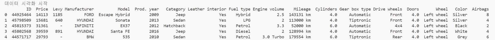

# 전처리(Preprocessing)

ML 모델은 데이터로부터 어떠한 패턴이나 특징을 찾습니다. 
그런데 데이터가 너무 들쭉날쭉이면 패턴을 찾기 힘들지 않을까요?

그래서 우리는 전처리를 해야합니다. 갑자기 너무 큰 수가 들어 있거나 값이 없는 경우가 있다면
이를 제거하거나 보정해주어야 합니다. 

다음 표를 한번 볼까요?
<p align="center">
  
</p>
앗 Mileage를 이용하여 총 주행 거리를 이용해 중고차의 가격을 추론하려했는데
숫자가 아닙니다! 143131 km와 같이 km이 붙은 문자열이네요.
그럼 이걸 숫자로 바꿔야 합니다. 

다음의 코드를 한번 볼꼐께요. Baseline/data_preprocessing.py 파일에 있는 코드 일부분입니다. 
```
df["Mileage"] = df["Mileage"].str.replace(" km", "", regex=True).astype(int)
```
이 코드는 df라는 데이터 집합의 Mileage라는 열의 데이터를 가져온 후, 
" km"을 ""(아무것도 없음)으로 대체하는 코드입니다.

# 학습

# 결과 제출
