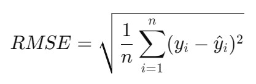

# 🚗 침수차? 이거 작동은 되는 거야?

<p align="left">
  
</p>

### 🗣️ 초롱이: _"...삼천이요"_  

초롱이가 마음대로 가격을 부르지 못하게,  
**중고차 가격 예측 모델을 만들어 주세요!** 🛠️  

---

## 🎯 **프로젝트 개요**  
🔍 **Mission**  
- 주어진 `train.csv` 데이터를 이용해 **중고차 가격 예측 모델**을 만드세요.  
- `test.csv` 데이터를 기반으로 예측값을 도출하고 `submission.csv`에 작성하세요.  

📊 **Dataset 구조**  
- **train 데이터**: `16351 rows × 18 columns`  
- **test 데이터**: `2886 rows × 17 columns`  
- **submission.csv**: `2886 rows × 2 columns` (목표 변수 `Price`는 0으로 채워져 있음)  

---

## 🏎️ **데이터 설명 (Feature Dictionary)**  

| 컬럼명 | 설명 |
|--------|------|
| **ID** | 각 차량의 고유번호 (개별 차량 식별용) |
| **Price** _(목표 변수)_ | 중고차 판매 가격 (USD) |
| **Levy** | 차량에 부과된 특정 세금 (일부 값은 `"-"` 처리됨) |
| **Manufacturer** | 제조사 (예: `LEXUS`, `CHEVROLET`, `HONDA`) |
| **Model** | 자동차 모델명 (예: `Toyota Corolla`, `BMW X5`) |
| **Prod. Year** | 차량 제조 연도 |
| **Category** | 차량 유형 (예: `SUV`, `Sedan`, `Hatchback`) |
| **Leather interior** | 가죽 시트 여부 (`Yes`/`No`) |
| **Fuel type** | 연료 유형 (`Petrol`, `Diesel`, `Hybrid`, `Electric`) |
| **Engine volume** | 엔진 배기량 (ℓ) (`1.6`, `2.0`, 또는 `"Turbo"` 포함 가능) |
| **Mileage** | 총 주행 거리 (km) |
| **Cylinders** | 엔진 실린더 개수 (`4기통`, `6기통`, `8기통` 등) |
| **Gear box type** | 변속기 종류 (`Automatic`, `Manual`) |
| **Drive wheels** | 구동 방식 (`전륜구동(Front)`, `후륜구동(Rear)`, `4륜구동(4x4)`) |
| **Doors** | 문 개수 |
| **Wheel** | 핸들 위치 (`Left wheel`, `Right-hand drive`) |
| **Color** | 차량 색상 (`White`, `Black`, `Silver`, `Blue` 등) |
| **Airbags** | 차량에 장착된 에어백 개수 |

---

## 📌 **예측 모델 만들기 가이드**  

1️⃣ **데이터 전처리 (Preprocessing)**  
   - 결측값 (`"-"`, `NaN` 등) 처리
   - 범주형 데이터 인코딩 (One-Hot Encoding, Label Encoding 등)  
   - 필요 시 데이터 스케일링 또는 정규화

2️⃣ **모델 학습 및 평가**  
   - 머신러닝 알고리즘 선택 (`Linear Regression`, `Random Forest`, `XGBoost` 등)  
   - 모델 평가는 'RSME'로 채점하게 됩니다. 

## 🏆 RMSE (Root Mean Squared Error)

RMSE는 예측값과 실제값의 차이를 제곱한 후 평균을 내고, 그 값을 제곱근으로 변환한 값입니다. 수식은 다음과 같습니다:
<p align="left">
  
</p>


사이킷런 예시:
```
from sklearn.metrics import mean_squared_error
import numpy as np

# 실제값(y_true)과 예측값(y_pred)
y_true = [3.0, -0.5, 2.0, 7.0]
y_pred = [2.5, 0.0, 2.1, 7.8]

# RMSE 계산
rmse = np.sqrt(mean_squared_error(y_true, y_pred))

print(f"RMSE: {rmse:.4f}")
```