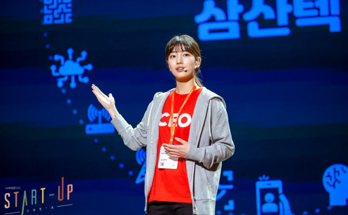

# 🚀 Welcome to the Show!  

안녕하세요, 패럿 여러분! 😊  
Machine Learning 첫 프로젝트의 시작을 환영합니다!  

퀀트부터 마케팅, AI챗봇까지 데이터 사이언스의 그 모든 것의 시작을 재미있게 경험해보고
또 다양한 의사결정에 대해 왜 그렇게 해야할지, 왜 그렇게 했는지 생각해보는 시간이 되면 좋을 것 같습니다

헷살리거나 이렇게 하는게 맞나하는 의문이 들면 언제든
[정지혁](http://jhcor.notion.site/Jihyeok-Jung-56a32ae6dd5640deb54e754e2148a8bc?pvs=4)에게 질문 주세요!

그럼, 시작해볼까요? 🎉  

---

## 📂 프로젝트 폴더 구성  

- **📄 `Docs/`** : 프로젝트 설명서 및 가이드 문서  
- **🖼️ `asset/`** : 멋진 이미지를 보관하는 폴더 (GitHub 페이지를 더욱 돋보이게!)  
- **📊 `Data/`** : 프로젝트에 필요한 데이터 폴더  
- **⚡ `Baseline/`** : 빠른 시작을 돕기 위한 샘플 코드 제공 (선택사항)  
- **🏆 `Result/`** : 예제 결과물을 저장하는 폴더  

---

## 📜 프로젝트 기술서  
🔗 [프로젝트 기술서](Docs/Project_explain.md)  

## 🏗️ 베이스라인 설명서  
🔗 [베이스라인 가이드](Docs/Baseline_explain.md)  

## 공개 테스트 데이터 리더보드 및 채점 사이트
🔗 [리더보드](https://script.google.com/macros/s/AKfycbxVA4ULkBQHf5q5ACxSGgueLDx7wHPMHG_jJO9h-HE3tNhmffY476QvNLYJllmClXCr/exec)

---

## 📢 **ML 프로젝트 발표 안내**  
<p align="center">
  
</p>
### 🔗 **노션 주소**  
👉 (To Be Continue!)  

### 📍 **제출 기한**  
🗓️ **04/09 (금) 18:00까지**  

### 📤 **제출해야 할 파일**  
팀별 대표 1명이 아래 파일을 제출해주세요.  
- 📝 **전체 코드** : `ML프로젝트_0조.ipynb`  
- 📊 **예측 결과 CSV** : `ML프로젝트_0조_submission.csv`  
- 🖼️ **발표 자료 (선택)** : `ML프로젝트_0조_발표자료.pptx`  

📌 **파일명 양식**  
```bash
1) ML프로젝트_0조.ipynb
2) ML프로젝트_0조_submission.csv
3) ML프로젝트_0조_발표자료.pptx (선택)
